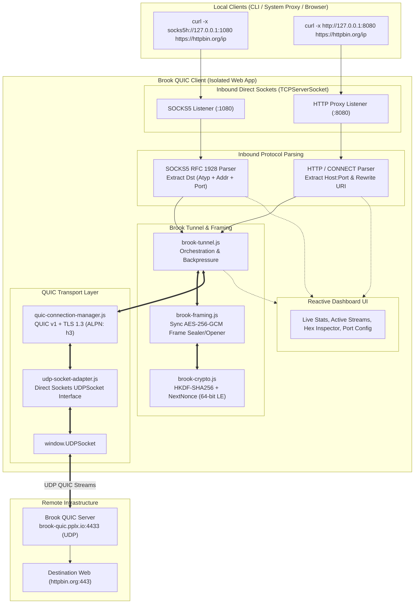
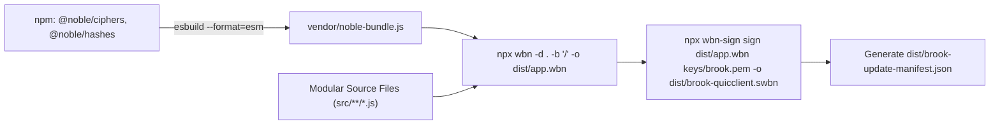

# Brook QUIC Client (IWA): Modular Dual SOCKS5 & HTTP Proxy Plan

A production-ready engineering plan to implement an in-browser **Isolated Web App (IWA)** version of the [Brook QUIC Client](https://github.com/txthinking/brook/blob/master/quicclient.go), supporting both **`--socks5`** and **`--http`** local proxy modes over the **Direct Sockets API** (`TCPServerSocket`, `UDPSocket`).

> [!IMPORTANT]
> **Modularity & Code Quality Constraint:** Every JavaScript source file is designed with a single responsibility and strictly constrained to **under 600 lines of code** (target: 100–350 lines per module).

---

## 1. Executive Summary & Architecture Overview

### Objective
Build an Isolated Web App that functions as a local **Dual-Protocol Proxy Server** (supporting both **SOCKS5** on `127.0.0.1:1080` and **HTTP / HTTPS CONNECT Proxy** on `127.0.0.1:8080`, plus a Smart Single-Port Auto-Detector) that tunnels all outbound TCP traffic through an encrypted **QUIC connection** to a remote Brook QUIC server (`quic://brook-quic.pplx.io:4433`, password: `271828brook`).

### Key Capabilities
1. **SOCKS5 Server Mode (`--socks5 127.0.0.1:1080`)**:
   - RFC 1928 state machine handling `CONNECT` requests (IPv4, Domain Name, IPv6) via Direct Sockets `TCPServerSocket`.
2. **HTTP / HTTPS Proxy Mode (`--http 127.0.0.1:8080`)**:
   - Handles `CONNECT host:port HTTP/1.1` (HTTPS tunneling) and standard plain HTTP absolute-URI requests (`GET http://...`).
3. **Smart Single-Port Auto-Detection (Unified Port Mode)**:
   - Distinguishes SOCKS5 preamble (`0x05`) from ASCII HTTP verbs (`CONNECT`, `GET`, `POST`, `HEAD`, etc.) to multiplex both protocols on a single port.
4. **QUIC Transport Layer**:
   - Browser-compatible QUIC transport engine operating directly over Chromium's `window.UDPSocket`.
   - **Strictly bypasses HTTP/3 layer**; operates at the raw QUIC Stream level with TLS 1.3 ALPN `"h3"`.
5. **High-Performance Synchronous Cryptography**:
   - Initial key derivation: `crypto.subtle.deriveBits()` (HKDF-SHA256).
   - Hot-path frame sealing & opening: Synchronous AES-256-GCM via `@noble/ciphers` to eliminate async microtask context switches during high-throughput proxying.

---

## 2. System Architecture



---

## 3. QUIC Engine Strategy & Browser Compatibility

### The Browser Compatibility Reality
Node.js QUIC libraries like `quico` depend heavily on `node:dgram`, `node:crypto` (sync), `node:buffer`, and `node:events`, none of which are native to Chrome IWAs. Furthermore, Brook requires **raw QUIC Streams**, not HTTP/3 requests.

### Solution: Multi-Tiered QUIC Transport Architecture
1. **Raw Stream Interface:**
   - Handshake performs TLS 1.3 negotiation with ALPN `["h3"]` (required by `quic-go` for middlebox compatibility).
   - HTTP/3 framing (QPACK, headers frames, data frame wrappers) is **completely bypassed**.
   - Bidirectional QUIC stream frames (`STREAM` frame types `0x08`–`0x0f`) are used directly for Brook data chunks.
2. **Transport Abstraction (`src/quic/udp-socket-adapter.js`):**
   - Bridges `window.UDPSocket` readable/writable WHATWG streams to the datagram packeting engine.
   - Manages MTU fragmentation and packet buffering.
3. **Pure-JS Browser Engine with `@noble/*` Primitives:**
   - Uses `@noble/ciphers` (AES-GCM, ChaCha20-Poly1305), `@noble/curves` (X25519, P-256), and `@noble/hashes` (SHA-256, HKDF) for all synchronous packet header protection, packet key derivation, and TLS 1.3 crypto operations.
   - Eliminates Node.js polyfill bloat and ensures 100% browser ESM compatibility.

---

## 4. High-Performance Cryptography & Wire Protocol

### A. Key Derivation & `WithoutBrook` Modes
* **Standard Mode (`WithoutBrook = false`, Default):**
  - Uses raw password bytes as HKDF input key material.
* **WithoutBrook Mode (`WithoutBrook = true`):**
  - First computes `SHA256(password)`, then uses the 32-byte digest as HKDF input key material.
* **HKDF Key Derivation (`ClientHKDFInfo = "brook"`, `ServerHKDFInfo = "brook"`):**
  ```javascript
  // Derive raw 32-byte key for synchronous @noble/ciphers AES-GCM
  export async function deriveKeyBytes(passwordBytes, nonce12, infoString = 'brook') {
    const keyMaterial = await crypto.subtle.importKey('raw', passwordBytes, 'HKDF', false, ['deriveBits']);
    const keyBits = await crypto.subtle.deriveBits(
      {
        name: 'HKDF',
        hash: 'SHA-256',
        salt: nonce12,
        info: new TextEncoder().encode(infoString)
      },
      keyMaterial,
      256
    );
    return new Uint8Array(keyBits);
  }
  ```

### B. Incremental Nonce Progression (`NextNonce`)
Brook increments the first 8 bytes of the 12-byte nonce as a Little-Endian unsigned 64-bit integer with wrapping:
```javascript
export function nextNonce(nonce12) {
  let v = (BigInt(nonce12[0])) |
          (BigInt(nonce12[1]) << 8n) |
          (BigInt(nonce12[2]) << 16n) |
          (BigInt(nonce12[3]) << 24n) |
          (BigInt(nonce12[4]) << 32n) |
          (BigInt(nonce12[5]) << 40n) |
          (BigInt(nonce12[6]) << 48n) |
          (BigInt(nonce12[7]) << 56n);
  v = (v + 1n) & 0xFFFFFFFFFFFFFFFFn;
  for (let i = 0; i < 8; i++) {
    nonce12[i] = Number((v >> BigInt(i * 8)) & 0xFFn);
  }
}
```

### C. Synchronous Frame Sealing & Opening (`src/core/brook-framing.js`)
Using `@noble/ciphers/aes` eliminates thousands of microtask switches per second on the hot path:

```javascript
import { gcm } from '@noble/ciphers/aes.js';

// Seal Frame: [Encrypted Len (2B) + Tag (16B)] + [Encrypted Data (LB) + Tag (16B)]
export function sealFrame(keyBytes, nonce12, payload) {
  const lenBuf = new Uint8Array(2);
  lenBuf[0] = (payload.length >> 8) & 0xFF;
  lenBuf[1] = payload.length & 0xFF;

  // 1. Encrypt Length (2 bytes) with current nonce
  const lenCipher = gcm(keyBytes, nonce12);
  const sealedLen = lenCipher.encrypt(lenBuf); // 2 + 16 = 18 bytes
  nextNonce(nonce12);

  // 2. Encrypt Payload (L bytes) with incremented nonce
  const payloadCipher = gcm(keyBytes, nonce12);
  const sealedPayload = payloadCipher.encrypt(payload); // L + 16 bytes
  nextNonce(nonce12);

  // 3. Pack contiguous buffer
  const out = new Uint8Array(18 + sealedPayload.length);
  out.set(sealedLen, 0);
  out.set(sealedPayload, 18);
  return out;
}

// Open Frame: Decrypts length, reads exact payload bytes, decrypts payload
export function openLength(keyBytes, nonce12, chunk18) {
  const lenCipher = gcm(keyBytes, nonce12);
  const lenBuf = lenCipher.decrypt(chunk18); // Throws on authentication failure
  nextNonce(nonce12);
  return (lenBuf[0] << 8) | lenBuf[1];
}

export function openPayload(keyBytes, nonce12, chunkPayloadAndTag) {
  const payloadCipher = gcm(keyBytes, nonce12);
  const payload = payloadCipher.decrypt(chunkPayloadAndTag);
  nextNonce(nonce12);
  return payload;
}
```

---

## 5. Inbound Protocols & Dispatcher

### A. SOCKS5 Protocol (RFC 1928)
* Handles authentication negotiation (`0x05 0x01 0x00` $\to$ `0x05 0x00`).
* Parses `CONNECT` command (`0x05 0x01 0x00` + `ATYP` + `DST.ADDR` + `DST.PORT`).
* Constructs Brook destination bytes: `dst = [ATYP, DST.ADDR..., DST.PORT (2B Big Endian)]`.
* Returns standard success reply (`0x05 0x00 0x00 0x01 0x00 0x00 0x00 0x00 0x00 0x00`).

### B. HTTP / HTTPS CONNECT Proxy Protocol
* **HTTPS Tunneling (`CONNECT host:port HTTP/1.1`):**
  - Extracts target `host:port`.
  - Encodes `dst` as `ATYP 0x03` (Domain Name) + 2-byte port.
  - Sends `HTTP/1.1 200 Connection Established\r\nProxy-Agent: Brook-IWA/1.3.0\r\n\r\n`.
  - Pipes subsequent TLS stream directly into Brook tunnel.
* **Plain HTTP Proxying (`GET http://example.com/path HTTP/1.1`):**
  - Extracts destination host and port 80.
  - Rewrites absolute URL to origin-form (`GET /path HTTP/1.1`).
  - Pipes rewritten HTTP request into Brook tunnel.

### C. Smart Protocol Auto-Detection
* Peeks at first byte of incoming connection:
  - `chunk[0] === 0x05` $\to$ SOCKS5 state machine.
  - `chunk[0]` is ASCII (`C`, `G`, `P`, `H`, `D`, `O`) matching HTTP methods $\to$ HTTP Proxy handler.

---

## 6. Modular Project Structure & Line Budget

Every JavaScript file has a single responsibility and strictly stays **under 600 lines** (target 100–350 lines):

```text
/root/downloads/iwa/brook-quicclient/
├── index.html                           # Control Dashboard HTML (Semantic, accessible)
├── styles.css                           # Modern UI Design System
├── app.js                               # Bootstrap & Orchestrator (~120 lines)
├── manifest.webmanifest                 # IWA Manifest with direct-sockets
├── .well-known/
│   └── manifest.webmanifest
├── src/
│   ├── core/
│   │   ├── byte-utils.js                # Endian readers/writers, hex helpers (~120 lines)
│   │   ├── brook-crypto.js              # HKDF-SHA256, NextNonce, key derivation (~160 lines)
│   │   ├── brook-framing.js             # Sync AES-256-GCM chunk sealer/opener (~190 lines)
│   │   └── brook-tunnel.js              # Tunnel orchestration & stream piping (~240 lines)
│   ├── protocols/
│   │   ├── socks5-parser.js             # RFC 1928 state machine & CONNECT parsing (~180 lines)
│   │   ├── http-proxy-parser.js         # HTTP CONNECT & plain HTTP URI rewriter (~190 lines)
│   │   └── protocol-detector.js         # Stream peeker (SOCKS5 vs HTTP auto-detect) (~90 lines)
│   ├── server/
│   │   ├── tcp-listener.js              # Direct Sockets TCPServerSocket wrapper (~170 lines)
│   │   ├── proxy-dispatcher.js          # Inbound router & connection handler (~220 lines)
│   │   └── session-tracker.js           # Active session state & speed calculation (~150 lines)
│   ├── quic/
│   │   ├── udp-socket-adapter.js        # window.UDPSocket datagram transport adapter (~220 lines)
│   │   └── quic-connection-manager.js   # QUIC client, TLS 1.3 handshake, stream pool (~280 lines)
│   └── ui/
│       ├── trusted-types-policy.js      # Trusted Types default policy (~40 lines)
│       ├── dom-builder.js               # Safe DOM creation helpers (0 innerHTML) (~220 lines)
│       ├── log-stream.js                # Bounded visual traffic log (500 max) + Hex Dump (~190 lines)
│       └── ui-controller.js             # Dashboard events, form bindings, live gauges (~320 lines)
├── vendor/
│   └── noble-bundle.js                  # Bundled @noble/ciphers + @noble/hashes (ESM)
└── assets/                              # Icons & graphic assets
```

### Module Line Budget Table

| File Path | Responsibility | Estimated Lines | Max Limit |
| :--- | :--- | :--- | :--- |
| `app.js` | Bootstrap orchestrator & module wiring | ~120 lines | < 600 |
| `src/core/byte-utils.js` | Binary data manipulation, endian readers, hex formatters | ~120 lines | < 600 |
| `src/core/brook-crypto.js` | HKDF-SHA256, `NextNonce`, key derivation helpers | ~160 lines | < 600 |
| `src/core/brook-framing.js` | Synchronous AES-256-GCM chunk sealing & opening | ~190 lines | < 600 |
| `src/core/brook-tunnel.js` | Bi-directional stream piping with backpressure control | ~240 lines | < 600 |
| `src/protocols/socks5-parser.js` | SOCKS5 handshake & destination extraction | ~180 lines | < 600 |
| `src/protocols/http-proxy-parser.js` | HTTP CONNECT tunneling & plain HTTP parsing | ~190 lines | < 600 |
| `src/protocols/protocol-detector.js` | First-byte protocol auto-detection | ~90 lines | < 600 |
| `src/server/tcp-listener.js` | `TCPServerSocket` lifecycle management | ~170 lines | < 600 |
| `src/server/proxy-dispatcher.js` | Inbound client dispatcher & listener manager | ~220 lines | < 600 |
| `src/server/session-tracker.js` | Active session tracking, telemetry, live speed calculation | ~150 lines | < 600 |
| `src/quic/udp-socket-adapter.js` | Direct Sockets `UDPSocket` transport adapter | ~220 lines | < 600 |
| `src/quic/quic-connection-manager.js` | QUIC connection pool & stream multiplexing | ~280 lines | < 600 |
| `src/ui/trusted-types-policy.js` | IWA Strict CSP Trusted Types compliance | ~40 lines | < 600 |
| `src/ui/dom-builder.js` | Safe DOM helpers (prevents TrustedHTML errors) | ~220 lines | < 600 |
| `src/ui/log-stream.js` | Bounded visual traffic log (500 max) + Hex Dump modal | ~190 lines | < 600 |
| `src/ui/ui-controller.js` | UI events, live gauges, settings persistence | ~320 lines | < 600 |

---

## 7. Reconnection, Error Handling & Scope

### A. Connection Model & Reconnection Strategy
* **Connection Lifecycle:** Maintains an active QUIC connection pool to `brook-quic.pplx.io:4433`.
* **Multiplexed Streams:** Inbound TCP requests open bidirectional streams on the existing QUIC connection for low-latency zero-RTT stream establishment.
* **Auto-Reconnection:** If the QUIC connection is terminated or idle-timed out:
  - Uses exponential backoff with jitter: $1\text{s} \to 2\text{s} \to 4\text{s} \to 8\text{s} \to \max 30\text{s}$.
  - Stale in-flight sessions receive clean TCP FIN/RST teardown.
  - New inbound proxy connections automatically trigger immediate QUIC re-handshake.

### B. Scope Matrix (v1.0 vs v2.0)
| Feature | v1.0 Scope | v2.0 Scope |
| :--- | :---: | :---: |
| **SOCKS5 TCP `CONNECT`** | ✅ Included | ✅ Included |
| **HTTP `CONNECT` & Plain HTTP** | ✅ Included | ✅ Included |
| **Unified Auto-Detect Port** | ✅ Included | ✅ Included |
| **Brook Stream Framing (AES-GCM)** | ✅ Included | ✅ Included |
| **WithoutBrook Password Mode** | ✅ Included | ✅ Included |
| **SOCKS5 UDP (`CmdUDP` Datagrams)** | ⏸️ Deferred | ✅ Added |

---

## 8. Build Pipeline & Packaging

The build pipeline uses **esbuild** to compile vendor dependencies into clean browser ESM before packaging into the Signed Web Bundle:



### Build Steps in `scripts/build-brook.js`
1. Bundle vendor crypto dependencies via esbuild to `vendor/noble-bundle.js`.
2. Generate app icons (`192x192`, `512x512`, SVG).
3. Package the app directory with `npx wbn -d ... -b "/" -o dist/brook-quicclient.wbn`.
4. Sign with Ed25519 private key to produce `dist/brook-quicclient.swbn`.
5. Generate `dist/brook-update-manifest.json` for seamless installation in Chrome.

---

## 9. Verification & Test Plan

### Test Scenario 1: SOCKS5 Proxy Mode
With the IWA running on `127.0.0.1:1080`:
```bash
# 1. HTTPS IP Echo via SOCKS5
curl -v -x socks5h://127.0.0.1:1080 https://httpbin.org/ip

# 2. HTTP Domain Test via SOCKS5
curl -v -x socks5h://127.0.0.1:1080 http://example.com
```

### Test Scenario 2: HTTP / HTTPS CONNECT Proxy Mode
With the IWA HTTP proxy running on `127.0.0.1:8080` (or `1080` in auto-detect mode):
```bash
# 1. HTTPS Tunneling via CONNECT method
curl -v -x http://127.0.0.1:8080 https://httpbin.org/ip

# 2. Plain HTTP Proxying (URI rewriting)
curl -v -x http://127.0.0.1:8080 http://example.com
```

### Test Scenario 3: Performance & Sustained Throughput
```bash
# SOCKS5 10MB Throughput test
curl -s -x socks5h://127.0.0.1:1080 https://speed.cloudflare.com/__down?bytes=10000000 -o /dev/null

# HTTP Proxy 10MB Throughput test
curl -s -x http://127.0.0.1:8080 https://speed.cloudflare.com/__down?bytes=10000000 -o /dev/null
```

### Acceptance Matrix
| Verification Item | Expected Output | Status |
| :--- | :--- | :--- |
| **SOCKS5 `httpbin.org/ip`** | Returns `{"origin": "45.63.20.230"}` | Planned |
| **HTTP `CONNECT` `httpbin.org/ip`** | Returns `{"origin": "45.63.20.230"}` | Planned |
| **Plain HTTP `example.com`** | Returns `HTTP/1.1 200 OK` | Planned |
| **File Line Lengths** | Every `.js` file strictly < 600 lines | Planned |
| **Hot-Path Performance** | Synchronous AES-GCM framing (zero microtask stalls) | Planned |
| **IWA Security / CSP** | Zero TrustedHTML / CSP violations under `isolated-app://` | Planned |
